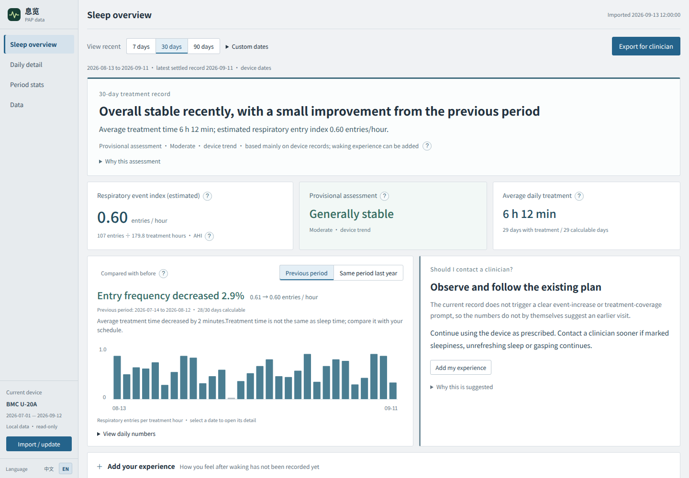

# Breath View · 息览

Breath View is a local-first viewer for BMC U-20A PAP/CPAP SD-card data. It
imports a read-only copy, shows treatment summaries and retained waveforms,
and prepares a cautious, evidence-linked follow-up summary.



> The preview uses synthetic, non-medical demo data. Do not publish a
> screenshot containing a real person's dates, device serial number, symptoms
> or treatment metrics.

## What it does

- **Sleep overview** — treatment time, estimated device-entry frequency,
  period comparisons and patient-entered follow-up context.
- **Daily detail** — synchronized flow, pressure, leak and optional ventilation
  charts, event markers and retained-record statistics.
- **Period statistics** — custom date ranges with missing summaries, pending
  days and missing waveforms kept distinct.
- **Offline exports** — CSV, a self-contained HTML review and a phone-sized
  HTML/PDF summary.
- **Patient timeline** — optional, device-scoped treatment-change notes with
  equal seven-day comparison windows and explicit non-causal wording.
- **Two interface locales** — Chinese (`zh-CN`) and English (`en-US`), with
  the selected language saved locally in the browser.

The decoder is deliberately conservative. Device entries are not presented as
validated clinical AHI, and the project does not infer sleep stages, oxygen
levels or pressure prescriptions.

## Quick start

```sh
python3 -m venv .venv
. .venv/bin/activate
pip install -r requirements.txt

# Import a folder, one .USR file, or a ZIP made from one card backup.
python3 app.py --import-card /path/to/card

# Start the local browser service and copy the printed URL into a browser.
python3 app.py --serve
```

For the desktop GUI, run `./launch.sh`. The GUI adds file and folder pickers;
the source card is opened read-only and copied into a private local archive.

Run the test suite with:

```sh
python3 -m unittest -v
```

## Data and privacy

The default archive is `~/.local/share/breath-view/`. Imports create an
independent snapshot and switch the `current` pointer only after decoding has
completed. Existing snapshots are not deleted automatically, and the source
SD card is never modified.

The default server binds to loopback and uses a random capability URL. A
remote deployment must add its own TLS and authentication boundary; do not
expose the application directly to the public Internet or share a capability
URL containing health data. Patient context is stored separately with private
file permissions. Logs omit the entered context values and note text.

Never commit `.USR`, numbered waveform files, `.idx`, `.evt`, `.log`, exported
reports, `patient-contexts.json`, access tokens or deployment secrets. The
repository ignore rules cover the common data and runtime files, but inspect
`git diff --cached` before every public push.

## Supported data and known limits

The currently validated input is the BMC U-20A format described in
[FORMAT.md](FORMAT.md). The independent decoder uses the USR summary and
same-stem numbered waveform files. The `.idx` and `.evt` files are not used by
the current import path.

The event index is an estimate based on device entries divided by settled
treatment hours. Missing summaries are not treated as zero use; pending days
are excluded from averages; retained waveform time does not replace the
summary's treatment duration. Channel semantics and event classification still
need item-by-item comparison with manufacturer output before stronger clinical
claims are appropriate.

This project is a record-review aid, not a medical device, diagnosis or
treatment-prescription system. Discuss results with a qualified clinician and
follow the manufacturer's instructions. Do not change pressure settings based
on this software. Do not drive or operate dangerous equipment when drowsy.

## Self-hosting

The Docker image serves the same local web UI on port `8080` and persists data
under `/data`:

```sh
docker build -t breath-view .
docker run --rm -p 127.0.0.1:8080:8080 -v breath-view-data:/data breath-view
```

The files in [deploy/](deploy/) are public examples only. Replace every
placeholder, keep OAuth client credentials outside Git, terminate TLS at a
trusted reverse proxy, and keep the upstream capability configuration on the
server. See [deploy/README.md](deploy/README.md) before using a non-loopback
binding.

## Project notes

- [FORMAT.md](FORMAT.md) records the decoded fields and evidence boundary.
- [docs/peer-reference-review.md](docs/peer-reference-review.md) records
  comparison notes without copying third-party parser code.
- The frontend is dependency-free vanilla HTML/CSS/JavaScript; the backend is
  Python with NumPy and optional PySide6 for the desktop GUI/PDF path.

## Contributing and license

See [CONTRIBUTING.md](CONTRIBUTING.md) and [SECURITY.md](SECURITY.md). This
repository is released under the [MIT License](LICENSE).

---

## English summary

Breath View is a local-first BMC U-20A PAP/CPAP SD-card viewer. It keeps the
source card read-only, stores private snapshots locally, separates settled,
pending and missing data, and links summary trends to retained waveforms. The
interface and generated review exports support Chinese and English.

The software only exposes conservative, estimated device-entry metrics. It is
not a diagnostic tool, does not establish clinical AHI, and must not be used
to change treatment settings. Keep real health data and deployment secrets out
of the public repository.

Patient-recorded treatment changes are stored separately with private file
permissions and are isolated by device. The public UI and exports show only
the selected period; comparison windows remain descriptive and do not infer
causation.
